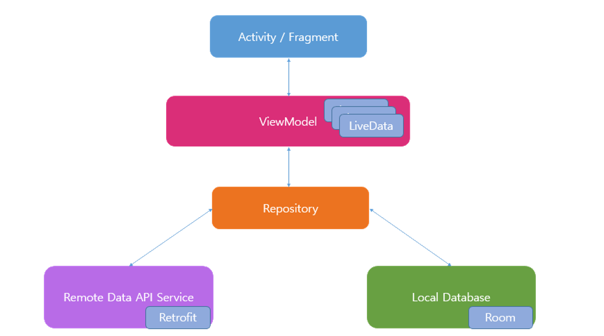

# HiltSample
Hilt (Dagger) : 2.28-alpha

Hilt, built on top of Dagger

* Direct annotation for Jetpack integration.
* Well defined Scopes for Android
* Testing API.

Android application, to show how to use Hilt

The goals of Hilt are:
•To simplify Dagger-related infrastructure for Android apps (70-75% less code lines).
•To create a standard set of components and scopes to ease setup, readability/understanding, and code sharing between apps.
•To provide an easy way to provision different bindings to various build types (e.g. testing, debug, or release).

@HiltAndroidApp (Application)
It generates all the component classes which we have to do manually while using Dagger.

@AndroidEntryPoint annotation can be used in,
Activity, Fragment, View, Service, BroadcastReceiver

@InstallIn(ApplicationComponent::class)
Scope application, activity, fragment, View, service level(Reduce load on Garbage collector).

@Singleton annotation helps the instance to be created and used once across the app.
@ViewModelInject annotation will inject the dependency using the constructor.

Features

1. MVVM
2. Retrofit
3. List of Countries
4. SVG to image view
5. Room db

Todo

Need to insert the data in room
Need to handle errors

Notice

Initial stage of mobile application development so I expect many bugs.